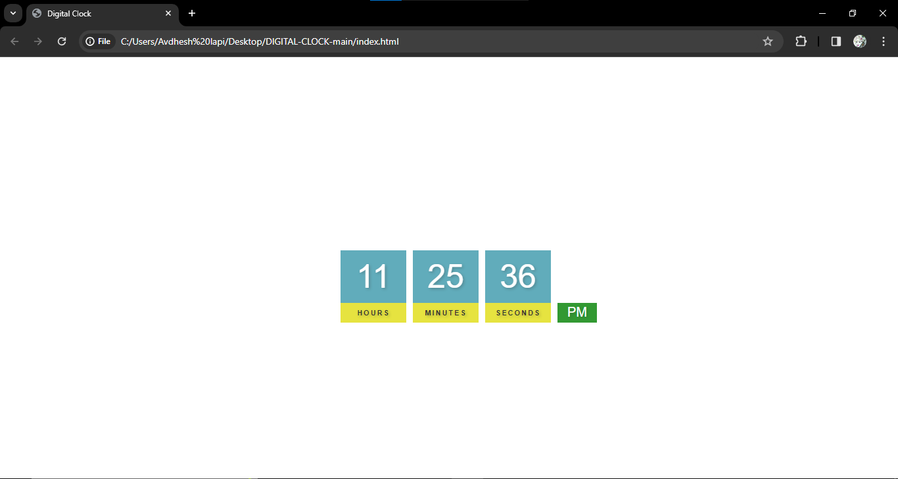

##Build a digial clock using html, css and javascript.

This project is a simple digital clock implemented using JavaScript. It displays the current time in hours, minutes, and seconds on a web page. The clock updates in real-time, reflecting the current time accurately.

## Features
-Get Time accurately.
-Use in Booking website that shows seconds in accurate to geting booking timely.
 

## Demo

Project Description:

This project is a simple digital clock implemented using JavaScript. It displays the current time in hours, minutes, and seconds on a web page. The clock updates in real-time, reflecting the current time accurately.

#How to Use:

#Clone the Repository:
Clone this repository to your local machine using the following command:

#Open the Project:
Navigate to the project directory and open the index.html file in a web browser.

#View the Digital Clock:
Once the index.html file is opened in the web browser, you'll see the digital clock displayed on the webpage.

#Project Structure:

index.html: This file contains the structure of the web page where the digital clock is displayed.

styles.css: This file contains the CSS styles for styling the digital clock display.

index.js: This file contains the JavaScript code responsible for fetching the current time and updating the clock display accordingly.

Technologies Used:

HTML: Used for creating the structure of the web page.

CSS: Used for styling the digital clock display.

JavaScript: Used for fetching the current time and updating the clock display in real-time.

